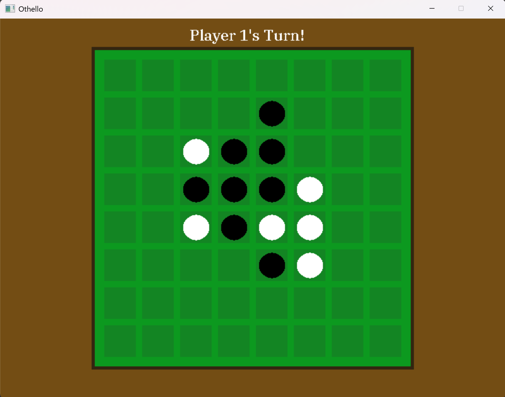

#Project04- OTHELLO

##Description

Othello is a simple game where two players battle to control the board by placing new pieces
to flip their opponent's pieces to their own colors. It is a simple turn-based grid-based game using SDL2.

##Rules

- Players must take turns adding new Player each round, by choosing a space to place it in.
- Player 1 controls white, Player 2 controls black.
- Your goal is to convert as many Player to your color as possible, before the board fills up or no more legal moves are possible.
- You may place a piece such that it creates a vertical, horizontal or diagonal occupied line between it and another of your Player,
with the opposing player's Player in the middle.
- Any of the opposing player's Player between these two Player of yours will be converted to your color.
Good luck.

##Controls

- Press E to start the game.
- Click to place your pieces in spots on the board.
- When the game is finished, press R to play again.
- Press Escape to exit.

##Screenshot

